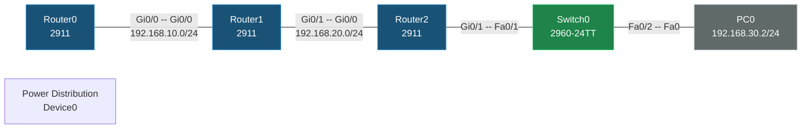

# Static Routing Lab

Source file: `Static Routing.pkt` — 3× Cisco 2911 routers, 1× 2960-24TT switch, 1 PC, 1 Power Distribution Device. Routing is entirely static (Router1 has an empty `router rip` block left in the config but no RIP networks are advertised, so it's effectively inactive).

## Topology



## Devices

| Device | Model | Role |
|---|---|---|
| Router0 | 2911 | Edge router, static routes to remote subnets |
| Router1 | 2911 | Middle router, static route to PC0 subnet |
| Router2 | 2911 | Access router, static route back to Router0's subnet |
| Switch0 | 2960-24TT | L2 access switch for PC0 |
| PC0 | PC-PT | 192.168.30.2/24, GW 192.168.30.1 |
| Power Distribution Device0 | iot_pdu | Present, unconnected |

## IP Plan

| Link / Subnet | CIDR | Router0 | Router1 | Router2 |
|---|---|---|---|---|
| R0 ↔ R1 | 192.168.10.0/24 | Gi0/0 = 192.168.10.1 | Gi0/0 = 192.168.10.2 | — |
| R1 ↔ R2 | 192.168.20.0/24 | — | Gi0/1 = 192.168.20.1 | Gi0/0 = 192.168.20.2 |
| PC0 LAN | 192.168.30.0/24 | — | — | Gi0/1 = 192.168.30.1 |

## Routing — static routes

**Router0** (needs to reach the 20.x and 30.x networks via Router1):
```
ip route 192.168.20.0 255.255.255.0 192.168.10.2
ip route 192.168.30.0 255.255.255.0 192.168.10.2
```

**Router1** (needs to reach the 30.x network via Router2):
```
ip route 192.168.30.0 255.255.255.0 192.168.20.2
```

**Router2** (needs to reach the 10.x network via Router1):
```
ip route 192.168.10.0 255.255.255.0 192.168.20.1
```

This is a classic 3-hop static routing chain: PC0 ↔ Switch0 ↔ Router2 ↔ Router1 ↔ Router0, with each router given just enough static routes to reach the two subnets it isn't directly attached to.

## Configs

### Router0
```
hostname Router0
interface GigabitEthernet0/0
 ip address 192.168.10.1 255.255.255.0
interface GigabitEthernet0/1
 shutdown
interface GigabitEthernet0/2
 shutdown
ip route 192.168.20.0 255.255.255.0 192.168.10.2
ip route 192.168.30.0 255.255.255.0 192.168.10.2
```

### Router1
```
hostname Router1
interface GigabitEthernet0/0
 ip address 192.168.10.2 255.255.255.0
interface GigabitEthernet0/1
 ip address 192.168.20.1 255.255.255.0
interface GigabitEthernet0/2
 shutdown
router rip
ip route 192.168.30.0 255.255.255.0 192.168.20.2
```

### Router2
```
hostname Router2
interface GigabitEthernet0/0
 ip address 192.168.20.2 255.255.255.0
interface GigabitEthernet0/1
 ip address 192.168.30.1 255.255.255.0
interface GigabitEthernet0/2
 shutdown
ip route 192.168.10.0 255.255.255.0 192.168.20.1
```

### Switch0
```
hostname Switch0
! Access ports Fa0/1 (to Router2) and Fa0/2 (to PC0), default VLAN 1, no L3 config
```

### PC0
```
PC0: 192.168.30.2 / 255.255.255.0 / GW 192.168.30.1
```
